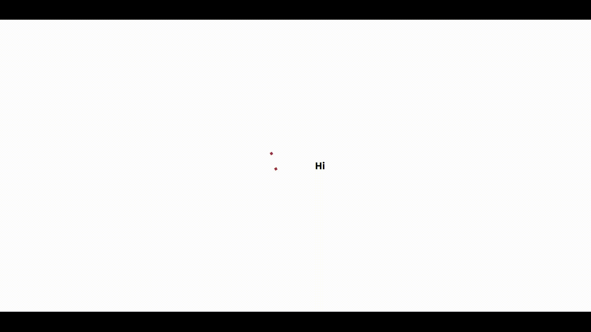
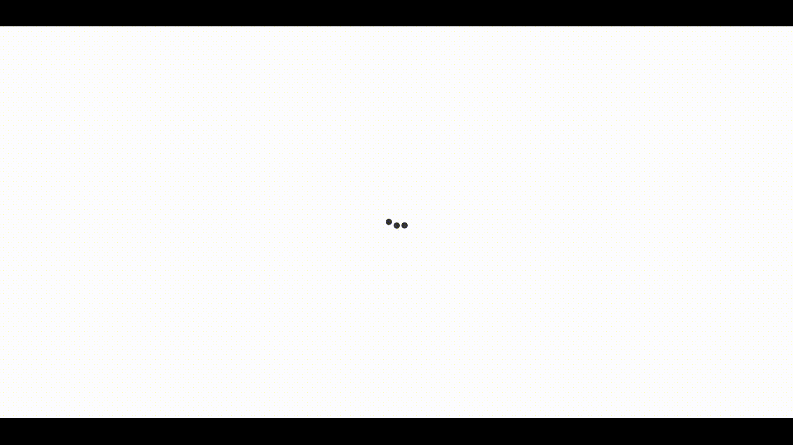
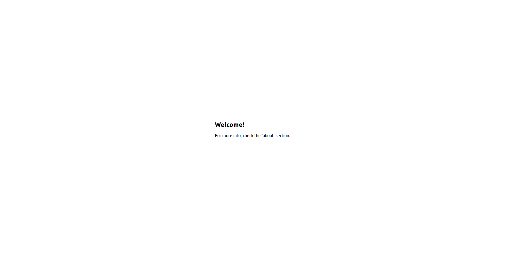

# Examples

## Using the Cube Transition

It's possible to use the Cube Transition as a decoration to a component.

### **Code**

To use The cube transition, you should import it inside the desired component and set a variable to control the loading state, in this case is used the 'isLoading', from the state. It's possible to personalize the color using a hexadecimal code, in this case is used a ton of red. The results are displayed in the section below.

```js
import React, { Component } from "react";
import { CubeTransition } from "react-pure-loaders";

export default class Cube extends Component {
  constructor(props) {
    super(props);

    this.state = {
      isLoading: true
    };
  }

  render() {
    const { isLoading } = this.state;
    return (
      <div
        style={{
          width: "10%",
          display: "flex",
          justifyContent: "space-between"
        }}
      >
        <CubeTransition loading={isLoading} color={"#a33a3a"} />
        <h1>Hi</h1>
      </div>
    );
  }
}
```

After the component creation, it's necessary to import it in another component to be displayed, in this case, it gonna be imported directly in the app component.

```js
import React from "react";

import Cube from "./components/Cube";

import "./App.css";

function App() {
  return (
    <div className="App">
      <Cube />
    </div>
  );
}

export default App;
```

### **Results**

When the variable isLoading is set as true, the component will be displayed, as showed in the picture below.



Setting the variable to false will result in this:


## Using the Ball Pulse Sync

### **What is gonna be created**

Imagine the following situation: you want to render a component to indicate that page is loading other component, for instance, this component could be retrieving some data from another source. So, you can use the Ball Pulse Sync to this. In this situation, it's created a component called IntroMessage that is responsible to render the appropiated elements, using the variable isLoading to control the rendering.

### **Working on the Problem**

To use this component, all you need to do is install the package and import the component inside the parent component. The component that will import the BallPulseSync is the IntroMessage, that's gonna use the variable isLoading, from setState, to define if the Ball Pulse sync will be loaded or not. While the retrieving is happening the Ball Pulse Sync will be display, and after its finished, the text will be displayed instead.

```js
import React, { Component } from "react";
import { BallPulseSync } from "react-pure-loaders";

export default class IntroMessage extends Component {
  constructor(props) {
    super(props);

    this.state = {
      isLoading: true
    };
  }

  render() {
    const { isLoading } = this.state;
    return (
      <div>
        {isLoading ? (
          <BallPulseSync loading={isLoading} color={"#333"} />
        ) : (
          <>
            <h2>Welcome!</h2>
            <p>For more info, check the 'about' section.</p>
          </>
        )}
      </div>
    );
  }
}
```

Importing the IntroMessage component in the app component to be rendered:

```js
import React from "react";

import IntroMessage from "./components/IntroMessage";

import "./App.css";

function App() {
  return (
    <div className="App">
      <IntroMessage />
    </div>
  );
}

export default App;
```

### **What we developed**

When the loading is happening, the app component will display the BallPulseSync, as showing below.



If the loading has finished, the text will be displayed.


